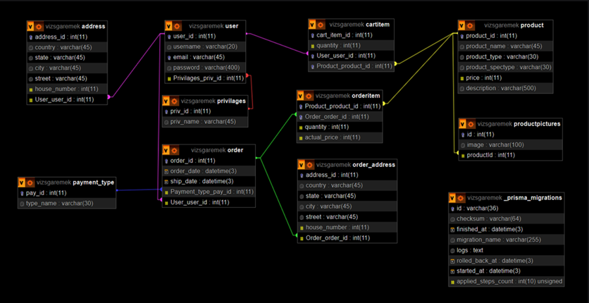

# <p style="text-align: center">Webshop</p>

This website is based on [NestJS](https://nestjs.com/) backend, [Prisma ORM](https://www.prisma.io/) for database handling, and [React](https://react.dev/) frontend.

<p style="text-align: center">
  <a href="http://nestjs.com/" target="blank"></a>
  
  <a href="http://nestjs.com/" target="blank"></a>
  
  <a href="http://nestjs.com/" target="blank"></a>
</p>

## Installation

### Node

Run ```npm install``` in the terminal, to install every package that is neccessary.<br/>
To start, run these commands in the terminal:

```shell
cd apps/api
nest start
```

### Database

### Scheme


[Here is our user Documentation](https://docs.google.com/document/d/1R06U-Mz__3be0curDXcm569DYGjBG380nZ9FCs628QI/edit?usp=sharing)

For the database, you have to install [XAMPP](https://www.apachefriends.org/download.html), and configure it. <br/>
The database should run on port 3306.
